# Lecture 2 by Dr. Mostak Ahmed 06/10/2022

## Classwork

### Definition of Function

> **If a variable y depends on a variable x in such a way that each value of x determines exactly one value of y, then we say that y is a function of x.**

**_Example:_**

| Is a Function                             | Is not a Function                   |
| ----------------------------------------- | ----------------------------------- |
| f(x)=x2; y=x2       | x=y2                     |
| 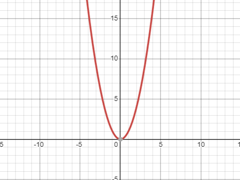                | 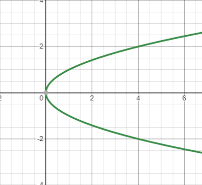 |
| cause we are getting one value of y for x | we are getting more than one value  |

### Four common methods for representing functions are:

- Numerically by tables:

| x   | y=x2 |
| --- | --------------- |
| 1   | 1               |
| 2   | 4               |
| 3   | 9               |

- Geometrically by graphs:

- Algebraically by formulas: y=x2 

- Verbally: function of x is the square of itself.

### Graphs of common equations

- y=x

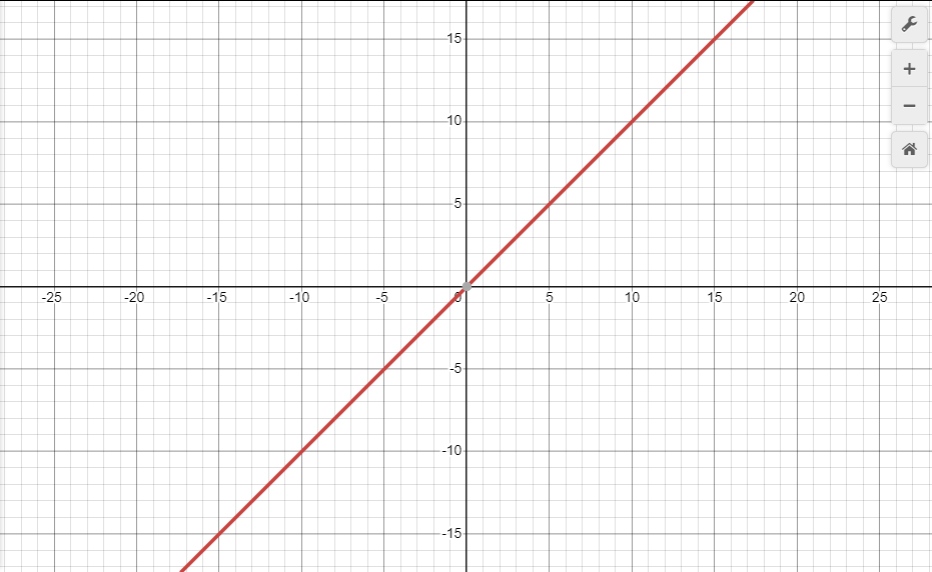

- y = x2

- y = x3

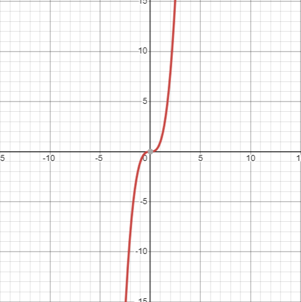

- y = 1/x

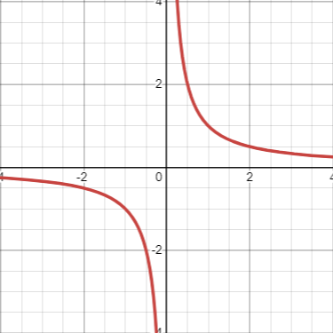

- y = $\sqrt{x}$

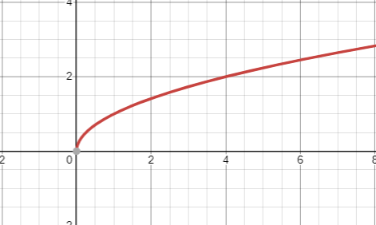

- y = $\sqrt[3]{x}$

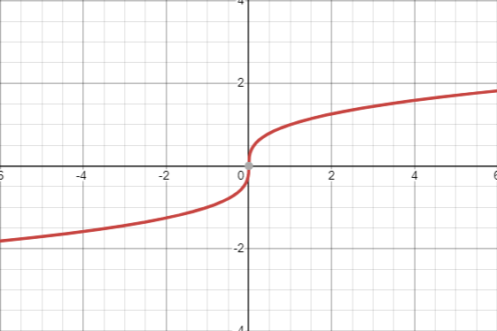

- half circle; y = $\sqrt{1-x^2}$

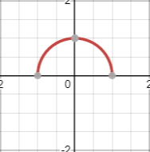

### The vertical line test

> **A curve in the xy-plane is the graph of some function f if and only if no vertical line intersects the curve more than once.**

**_Example:_**

| Is a Function                                                       | Is not a Function                                                        |
| ------------------------------------------------------------------- | ------------------------------------------------------------------------ |
| f(x)=x2; y=x2                                 | x=y2                                                          |
| 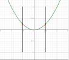                                     | 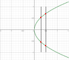                                        |
| cause the vertical line is intersecting the curve at only one point | cause the vertical line is intersecting the curve at more than one point |

### Graph of absolute value:

y = |x|  

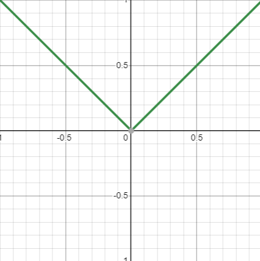

#### properties of absolute value (If a and b are real numbers, then)

1. |-a| = |a| ----A number and its negative have the same absolute value.
2. |ab|=|a| |b| ----The absolute value of a product is the product of the absolute values.
3. |a/b|=|a|/|b|, b ≠ 0 ----The absolute value of a ratio is the ratio of the absolute values.
4. |a+b| ≤ |a|+|b| ----The triangle inequality.

### PIECEWISE-DEFINED FUNCTIONS

> **The absolute value function f(x) = | x| is an example of a function that is defined piecewise in the sense that the formula for f changes, depending on the value of x.**

<pre>
⎧ 0,       x ≤ −1

⎨ √1 − x2, −1 < x < 1
⎩ x,       x ≥ 1
</pre>

> the graph will be:  
> 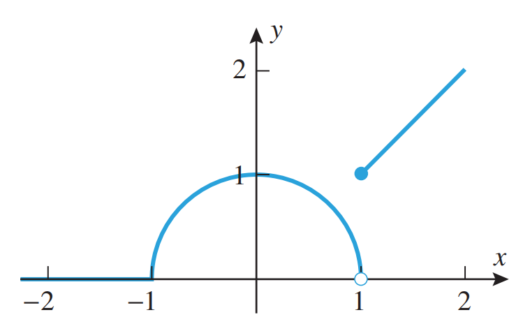
