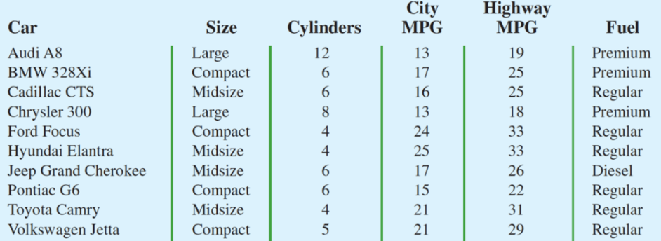
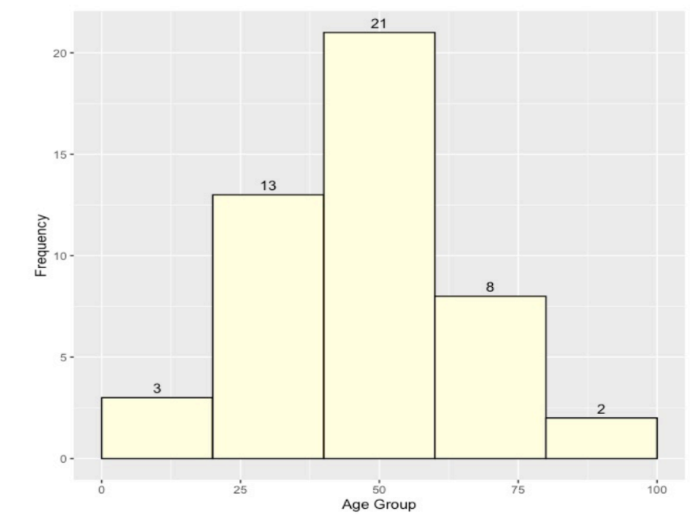

# Assignment 1

1. The Ritz-Carlton Hotel used a customer opinion questionnaire to obtain performance data about its dining and entertainment services (The Ritz-Carlton Hotel, Naples, Florida, February 2006). Customers were asked to rate six factors: Welcome, Service, Food, Menu Appeal, Atmosphere, and Overall Experience. Data were recorded for each factor with 1 for Fair, 2 for Average, 3 for Good, and 4 for Excellent.

   - a. The customer responses provided data for six variables. Are the variables categorical or quantitative? [6]
   - b. What measurement scale is used? [6]

2. State whether each of the following variables is categorical or quantitative and indicate its measurement scale. [10]

   - a. Annual sales
   - b. Soft drink size (small, medium, large)
   - c. Employee classification (GS1 through GS18)
   - d. Earnings per share
   - e. Method of payment (cash, check, credit card)

3. The Hawaii Visitors Bureau collects data on visitors to Hawaii. The following questions were among 16 asked in a questionnaire handed out to passengers during incoming airline flights in June 2003.

   - This trip to Hawaii is my: 1st, 2nd, 3rd, 4th, etc.
   - The primary reason for this trip is: (10 categories including vacation, convention,honeymoon)
   - Where I plan to stay: (11 categories including hotel, apartment, relatives, camping)
   - Total days in Hawaii
     - What is the population being studied? [1]
     - Comment on each of the four questions in terms of whether it will provide categorical or quantitative data. [4]

4. Refer to the following table.
    
   
   - a. What is the average miles per gallon for city driving? [1]
   - b. On average, how much higher is the miles per gallon for highway driving as compared to city driving? [1] 
   - c. What percentage of the cars use regular fuel? [1]

5. Fill in the following table on number of hours slept in a study on 100 individuals:

<table>
<thead>
<tr>
<th>Class Interval</th>
<th>frequency </th>
<th>Relative Frequency </th>
<th>Cumulative Frequency(less than type)</th>
<th>Cumulative relative frequency (less than type)</th>
</tr>
</thead>
<tr><td>3-5</td><td>15</td><td></td><td></td><td></td></tr>
<tr><td>5-7</td><td>40</td><td></td><td>B</td><td>C</td></tr>
<tr><td>7-9</td><td>30</td><td>A</td><td></td><td></td></tr>
<tr><td>9-11</td><td>15</td><td></td><td></td><td></td></tr>
</table>

    - Find the value of A, B, and C and comment on each occasion. [6]

6. The following chart shows the age of the respondents.
   

- a. How many people are of age 20 to 60 years old? [1]
- b. How many people are of age at least 40 years old? [1]
- c. What is the class interval? [1]
- d. What is this chart called? [1]
