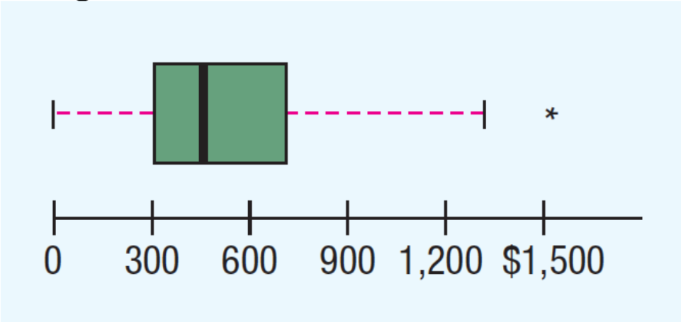

1. The Los Angeles Times regularly reports the air quality index for various areas of Southern California. A sample of air quality index values for Pomona provided the following data:

   28, 42, 58, 48, 45, 55, 60, 49, and 50.

   (i) Compute the range and interquartile range. [1+4]

   (ii) Compute the sample variance and sample standard deviation. [2+1]

   (iii) A sample of air quality index readings for Anaheim provided a sample mean of 48.5, a sample variance of 136, and a sample standard deviation of 11.66. What comparisons can you make between the air quality in Pomona and that in Anaheim based on these descriptive statistics? [4]

2. Below is the number of customers who visited Smith’s True-Value hardware store in Bellville, Ohio, over the last twenty-three days.

   46 52 46 40 42 46 40 37 46 40 52 32 37 32 52 40 32 52 40 52 46 46 52

   (i) Calculate the coefficient of skewness and comment on the shape of the data. [4+1]

   (ii) Draw a box and whiskers plot. Is there any outlier? If yes, what are those. [4+1]

3. The box plot shows the undergraduate in-state tuition per credit hour at four-year public
   colleges.
   

   (i) Estimate the median. [1]

   (ii) Estimate the first and third quartiles. [2]

   (iii) Determine the interquartile range. [1]

   (iv) Beyond what point is a value considered an outlier? [2]

   (v) Identify any outliers and estimate their value. [1]

   (vi) Is the distribution symmetrical or positively or negatively skewed? [1]
