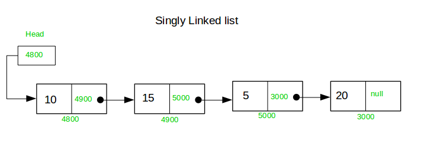

# Lab: 2; Linked List

- Linked List is a sequence of links which contains items. Each link contains a connection to another link. Linked list is the second most-used data structure after array.

<!-- Image here -->
- Create a List ADT with the following operations.
<table><thead><tr><th> Operation </th><th> Description </th></tr></thead><tbody><tr><td> 1. void add(int item) </td><td> Add item to the end of the List </td></tr><tr><td> 2. void addbegin(int item) </td><td> Add item at the beginning of the list </td></tr><tr><td> 3. void addanypos(int pos, int item) </td><td> Add item at position pos in the List, moving the items originally in positions pos . </td></tr><tr><td> 4. bool contains(int item) </td><td> return true iff item is in the List  </td></tr><tr><td> 5. int size() </td><td> return the number of items in the List </td></tr><tr><td> 6. bool isEmpty() </td><td> return true iff the List is empty </td></tr><tr><td> 7. int get(int pos) </td><td> return the item at position pos in the List (error if pos is less than 0 or greater than or equal to size()) </td></tr><tr><td> 8. int indexOf(int item) </td><td> Return position of the specified element in the list </td></tr><tr><td> 9. void removefirst() </td><td> Remove first element of the list </td></tr><tr><td> 10. void removelast() </td><td> Remove last element of the list </td></tr><tr><td> 11. void remove(int pos) </td><td> remove and return the item at position pos in the List </td></tr><tr><td> 12. void reverse() </td><td> Reverse the element of the list </td></tr><tr><td> 13. void sort() </td><td> Sort the element of the list in ascending order </td></tr></tbody></table>
