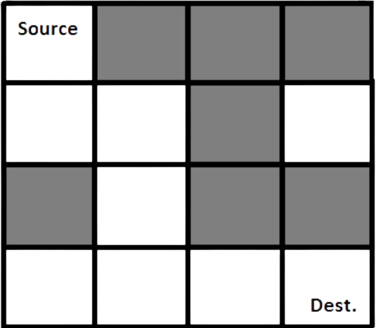

# CSE 245: Algorithms Project: Maze Path Finding

A maze is a path or collection of paths, typically from an entrance to a goal. The word is used to refer both to branching tour puzzles through which the solver must find a route, and to simpler non-branching ("unicursal") patterns that lead unambiguously through a convoluted layout to a goal.



Gray blocks are dead ends. Now design a suitable algorithm to find the path from source to destination. You have to use a backtracking approach to find the path. Also keep in mind that a brute force solution is not allowed.

A maze is given as an N\*N binary matrix of blocks where the source block is the upper leftmost block i.e., `maze[0][0]` and the destination block is the lower rightmost block i.e., `maze[N-1][N-1]`. Possible moves are forward and down.

## Standard Input

```shell
12
1 0 0 0 0 0 0 0 0 0 0 0
1 1 1 0 1 1 0 0 0 0 0 0
0 0 1 0 0 1 0 0 0 0 0 0
0 0 1 1 0 1 1 1 1 1 1 0
0 0 0 1 0 0 0 0 0 0 1 0
0 0 0 1 1 1 0 0 0 0 1 0
0 0 0 0 0 1 0 0 0 0 1 0
0 0 0 0 0 1 1 1 1 0 1 0
0 0 0 0 0 0 0 0 1 0 1 0
1 1 1 1 1 1 1 0 1 1 1 0
0 0 0 0 0 0 0 0 0 0 1 0
0 0 0 0 0 0 0 0 0 0 1 1
```

Where `1` is the path and `0` is the wall (block).

## Standard Output

```shell
Solution Path:
1 0 0 0 0 0 0 0 0 0 0 0
1 1 1 0 0 0 0 0 0 0 0 0
0 0 1 0 0 0 0 0 0 0 0 0
0 0 1 1 0 0 0 0 0 0 0 0
0 0 0 1 0 0 0 0 0 0 0 0
0 0 0 1 1 1 0 0 0 0 0 0
0 0 0 0 0 1 0 0 0 0 0 0
0 0 0 0 0 1 1 1 1 0 0 0
0 0 0 0 0 0 0 0 1 0 0 0
0 0 0 0 0 0 0 0 1 1 1 0
0 0 0 0 0 0 0 0 0 0 1 0
0 0 0 0 0 0 0 0 0 0 1 1
```

## Future Scope

Modify the algorithm such that the object in the maze can move in four directions.
